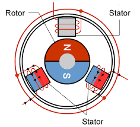

# Robotics Theory

## Introduction

Robotics is a very broad field that encompasses many different areas of study. In this section, we will cover the basics of robotics and how they apply to FRC (FIRST Robotics Competition) programming.

This will include topics such as kinematics, dynamics, control systems, and sensors. Understanding these concepts will help you to better understand the code and how it interacts with the robot hardware.

## Fundamentals of Robotics

Robotics Programming is built on interpreting many data sources:

- **Sensors** (e.g., cameras, encoders, gyros)
- **Actuators** (e.g., motors, servos, pneumatics)
- **Input Devices** (e.g., joysticks, buttons)
- **Output Devices** (e.g., LEDs, displays)

## Kinematics

Kinematics is the study of motion without considering the forces that cause it. In robotics, kinematics is used to describe the motion of robots and their components. This includes the position, velocity, and acceleration of the robot and its parts.

In robotics prgramming, kinematics is used to calculate the position and orientation of the robot based on the input from sensors. This information is then used to control the robot's movement and behavior.

Kinematics is useful for controlling:

- **Drivetrains** (e.g., differential drive, swerve drive)
- **Arms** (e.g., linear actuators, rotary actuators)
- **Multi -DOF Systems** (e.g., robotic arms, legs)
- **Path Planning** (e.g., trajectory generation, motion profiling)

### Forward Kinematics vs Inverse Kinematics

- Forward Kinematics takes the joint angles and calcualtes the final position
- Inverse Kinematics takes the final position and calculates the joint angles

## Path Planning

Path planning is the process of determining a path for the robot to follow. This can be done using various algorithms, such as A*. But it can also be precompiled using tools like PathPlanner and Choreo.

This is useful for:

- **Autonomous** (e.g., pre-defined paths, dynamic paths)
- **Driver Assistance** (e.g., vision tracking, auto-alignment)
- **Obstacle Avoidance** (e.g., dynamic path replanning, collision avoidance)

## Motor Physics

Motor physics is the specific physics of motors and how they function on a physical scale. This includes the torque, speed, and power of the motors, as well as the forces acting on them.

:::warning
We will only consider the physics of Brushless DC (BLDC) motors, as this is the most common type of motor used in FRC.
This includes the NEO, Falcon 500, Kraken, Minion, and other similar motors.
:::

:::warning
This guide will assume that you have a basic understanding of physics such as Newton's Laws of Motion, Torque, and Force.
:::

:::info
This is a very complex topic and requires a deep understanding of classical physics and electro-magnetism.
A more in-depth explanation can be found online.
:::

### Geometry of a BLDC motor

BLDC Motors use sets of coils in the Stator and sets of permanent magnets in the Rotor to drive the Rotor shaft. By using the natural opposing and repulsive forces of magnets, electro-magnets in the Stator are controlled sychronously (often in a $\sin$ wave) to repel and attract the Rotor's permanent magenets, allowing the Rotor to rotate.

The Rotor velocity and acceleration can be changed by altering the electro-magnets' electrical input through modifying the Current and Voltage fed into the coils.

#### Advantages of BLDC Motors

- Last Longer
- Produce less heat and friction
- More efficient
- More raw power and longer constant power
- More accurate
- Lighter weight
- Less Danger (Fire Hazard, Shocks, etc.)

#### Disadvantages of BLDC Motors

- More expensive
- Requires a motor controller to operate
- Requires sensors (encoders) to properly spin

### Connection between Amperage and Linear Acceleration in BLDC Motors

:::note Symbol Denotations
$I$ Represents Current.
$ k_T $ Represents the torque constant of the BLDC motor

:::

- Since $F = m \cdot a $, then $F \propto a $
- Then, since $ \tau = F \cdot r $
- Therefore $ \tau \propto F \propto a $
- Since $ I =  \frac{\tau}{k_T}  $
- Thus $ I \propto \tau \propto F \propto a $

Through these equations, we can prove the link between the Amperage a motor recieves, and the total acceleration is experiences.

:::note
Although the equation process shows linear acceleration ($a$), angular acceleration is also applicable ($\alpha$).
:::

### Connection between Voltage and Angular Speed in BLDC Motors

In most situtations, BLDC motors will spin faster with a higher voltage input into the stators. Since it is easier for motor controllers to adjust the input voltage into the stators, generally, Voltage is the primary control method for BLDC motors.

:::warning

The connection between voltage and velocity is **NOT** a direct link. There are no physical equations that directly link the voltage to angular speed, unless considering an ideal world.

The connection between Voltage and Velocity is mostly observed, not theoreticaly established.
:::
